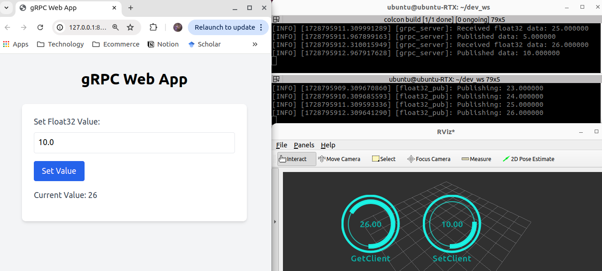
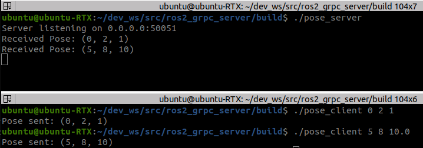

# ros2_grpc_server

[](https://github.com/tasada038/ros2_grpc_server/stargazers/)
[](https://github.com/tasada038/ros2_grpc_server/forks/)
[](https://github.com/tasada038/ros2_grpc_server/issues/)
[](https://github.com/tasada038/ros2_grpc_server/blob/master/LICENSE)

## Overview

This package is a server for bridging ROS 2 and gRPC.

**Keywords:** ROS 2, gRPC

## Build and Run
First, run the following in the terminal:
```bash
cd ~/dev_ws
colcon build --packages-select ros2_grpc_server --cmake-args -DBUILD_CPP_SOURCE=OFF
. install/setup.bash
ros2 run ros2_grpc_server float32_server
```
Second, run the following in the terminal:
```bash
cd ~/dev_ws && . install/setup.bash
ros2 topic pub -r 1 /data std_msgs/msg/Float32 "{data: 5.0}"
```
Finally, run the following in the terminal:
```bash
cd ~/dev_ws/src/ros2_grpc_server/script && python3 grpc_client.py
```



If you want to communicate only with gRPC, please execute the following.
```bash
cd ~/dev_ws
colcon build --packages-select ros2_grpc_serer

cd ~/dev_ws/src/ros2_grpc_server/build
cmake ..
make
./pose_server
./pose_client 0 2 1
```



## License
The source code is released under a [MIT license](LICENSE).