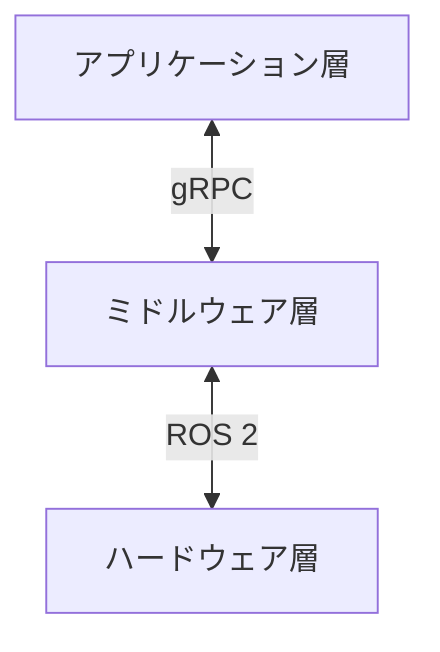
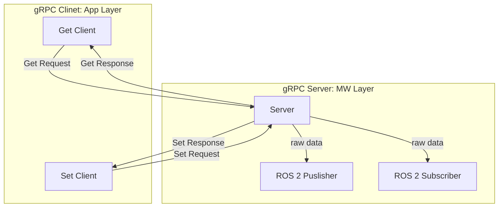
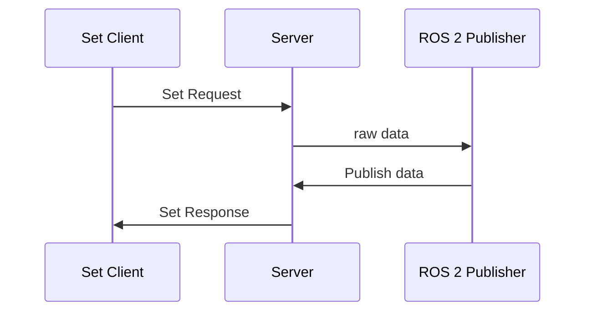
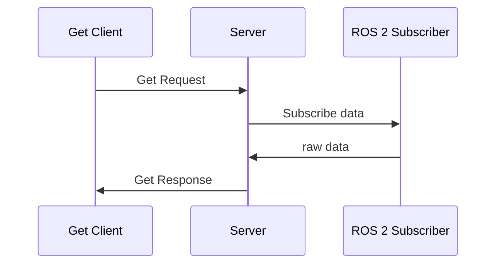

# Software Architecture Diagram

## gRPC Diagram

## gRPC Sequence
* Set Client Sequence

* Get Client Sequence

# Reference

https://github.com/Sollimann/CleanIt

https://github.com/pf-robotics/kachaka-api

https://github.com/bufbuild/protobuf-es